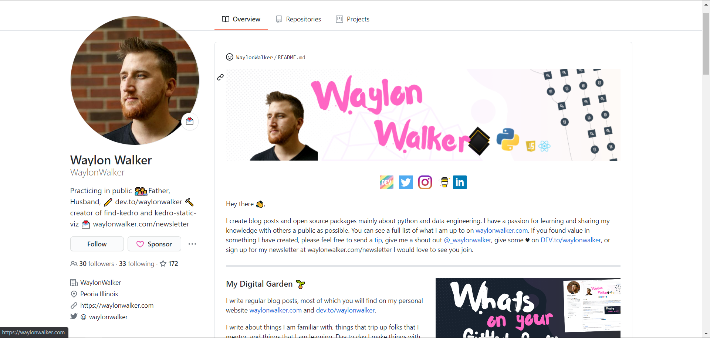
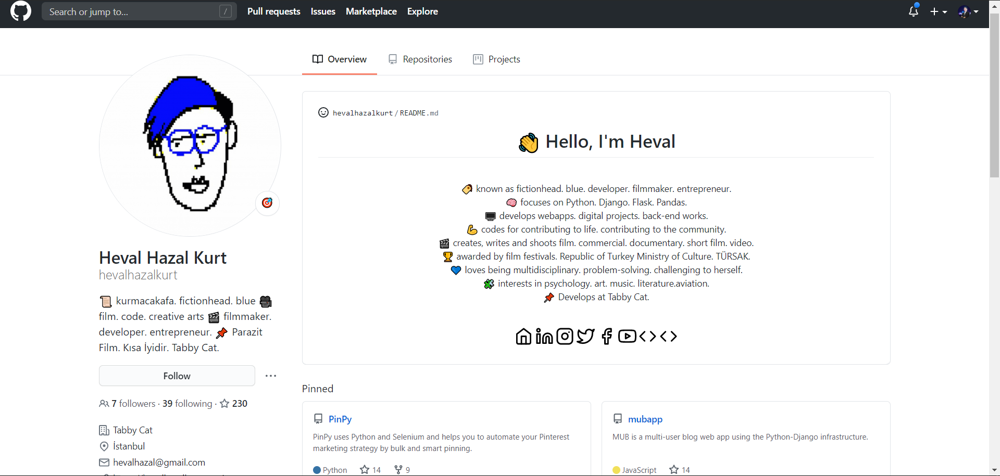

<h1 align="center">
  Github Readme Resumes
  

 
 

</h1>
<h2 align="center">
  Github recently introduced Readme Resumes where you can showcase your projects, a note or anything using a readme file.
 
 

    
    
    
    
    
    
    
    
    
    
    

</h2>

This repository contains a collection of GitHub README Resumes for your GitHub profile. 
Choose one and follow these steps to add it into your profile.

- Select your prefered Readme resume from samples in this repository.
- Click on the readme file and open the RAW Readme.md file using editor icon. Or simply clone this repository into your local space and copy the content.
- Create a new GitHub repository with your Github username. (Ex: if your username is 'sweetpotato' your repository name should be sweetpotato.)
- Paste the coppied readme file into your new repository.
- Change the content.
- Make it public. Yeah, that's it!

You will see your cool GitHub Resume in your profile page.

## Sample 01

## Sample 02

### Be creative! Don't forget to rate this repository 💙 

## Contribution
- Please make a pull request with your cool ideas!

MIT © Asiri H. @asirihewage
